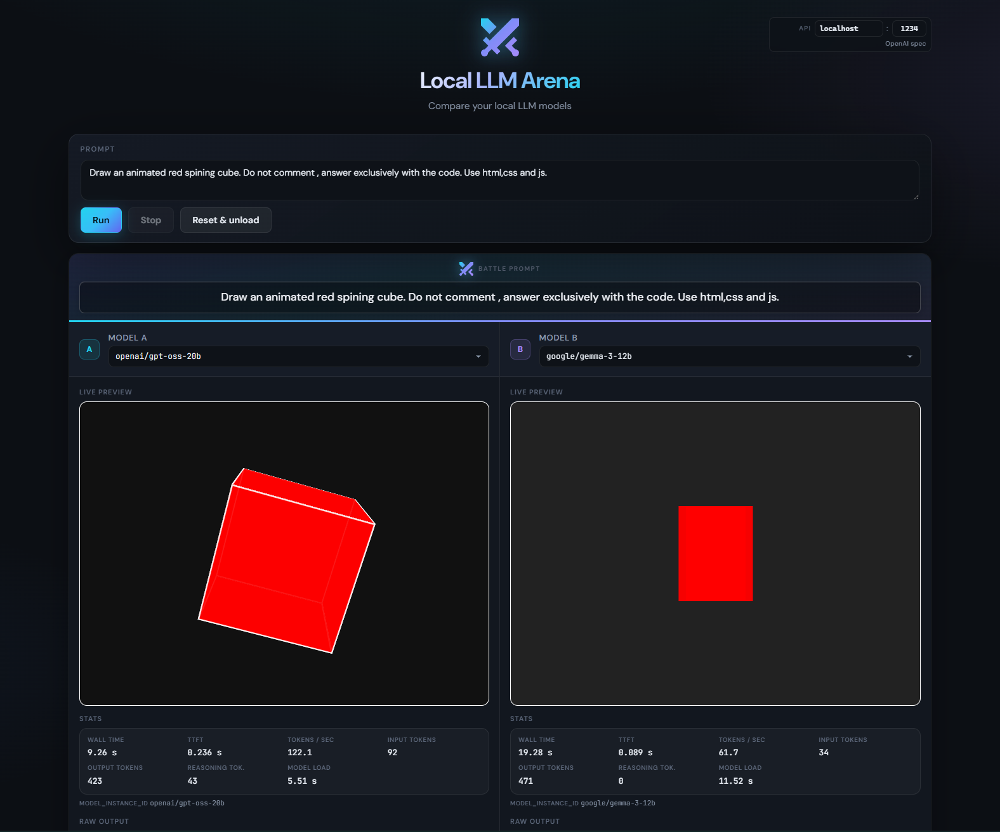

# Local LLM Arena

Simple web app to compare outputs from two local LLM models side by side.

It is designed to work with any server exposing an OpenAI-compatible API shape (for example LM Studio or Ollama-compatible gateways).

## Features

- Compare **Model A** and **Model B** on the same prompt
- Live HTML preview of each model output
- Raw output + response stats (TTFT, tokens/s, token counts, wall time)
- Battle history for quick visual comparison
- Runtime API configuration from the UI (`host` + `port`)
- Stop current generation without resetting everything

## Tech Stack

- React 18
- Vite 5

## Prerequisites

- Node.js 18+ (or Bun)
- A local LLM server exposing compatible endpoints:
  - `GET /api/v1/models`
  - `POST /api/v1/chat`
  - `POST /api/v1/models/unload` (optional but used by this app)

## Getting Started

Install dependencies :


```bash
npm install
```

Run development server:

```bash
npm run dev
```

Alternative:

```bash
npm run dev
```

By default, the app runs on [http://localhost:3000](http://localhost:3000).

## Build

```bash
npm run build
```

Preview production build:

```bash
npm run preview
```

## How to Use

1. Open the app.
2. In the top-right API config, set your server `host` and `port` (defaults: `localhost:1234`).
3. Select at least one model (`A` and/or `B`).
4. Enter a prompt and click **Run**.
5. Use **Stop** to cancel an in-flight run, or **Reset & unload** to clear state and unload models.

## Demo



